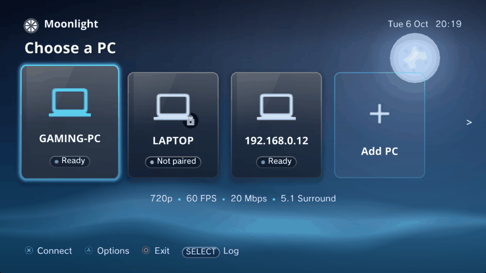
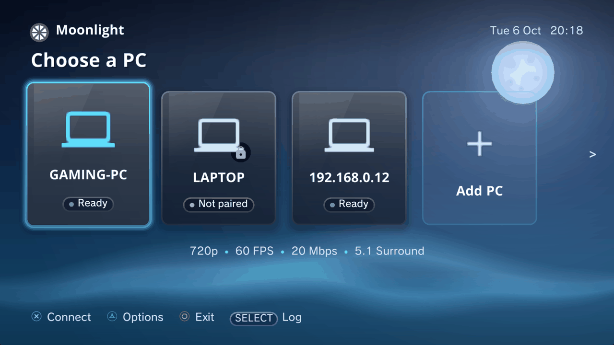
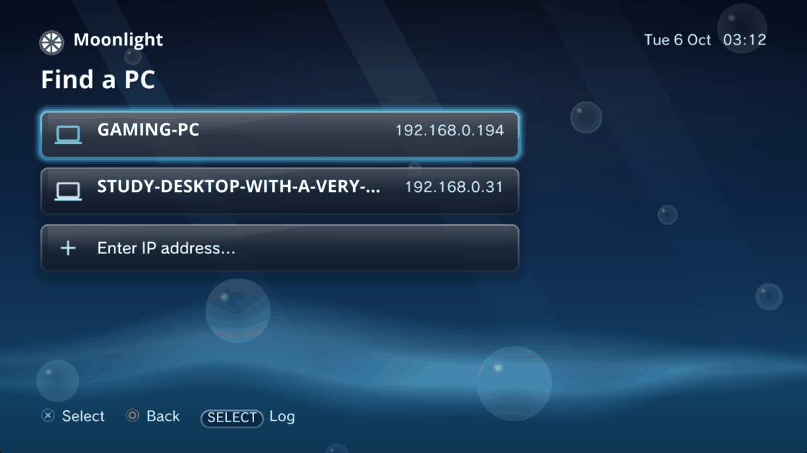
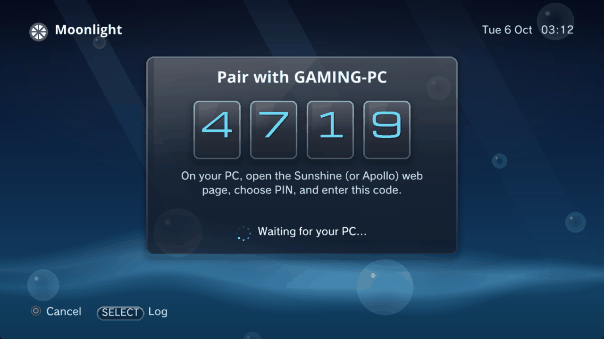
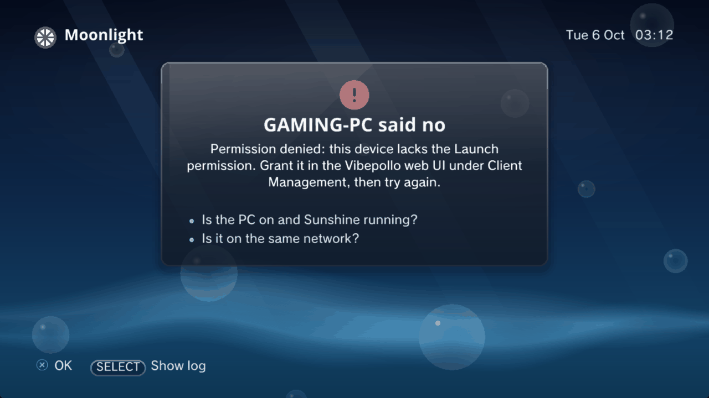
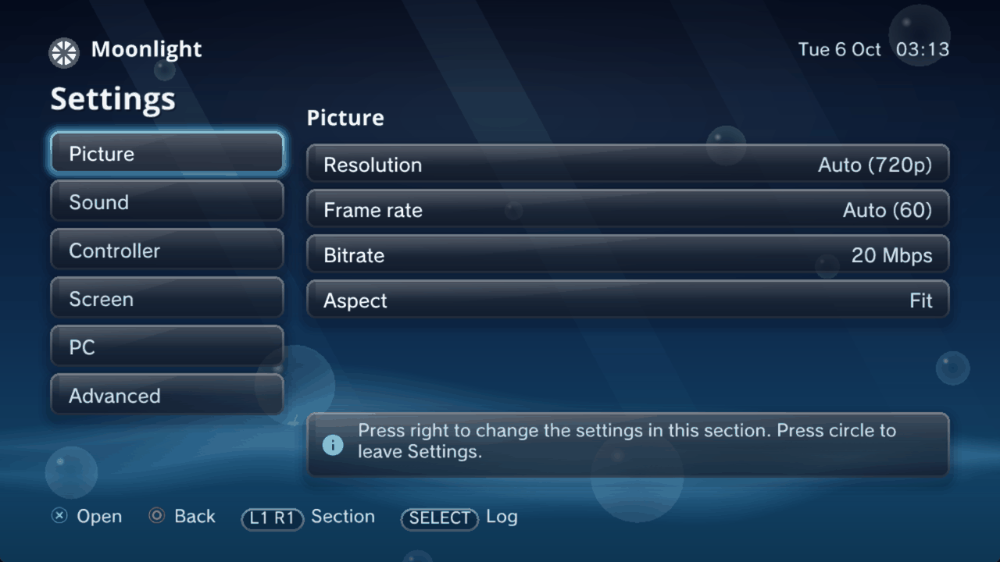
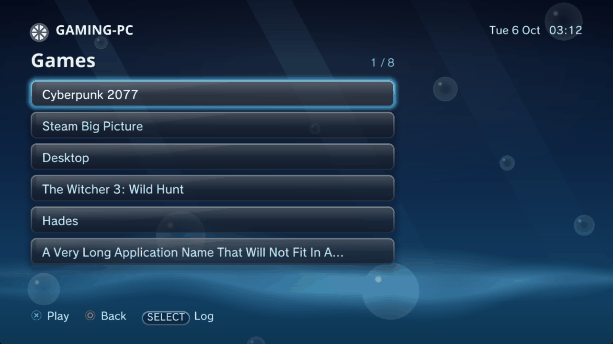
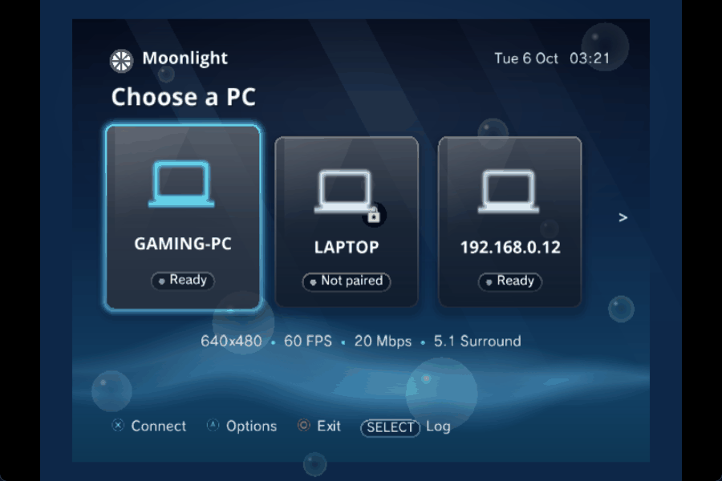
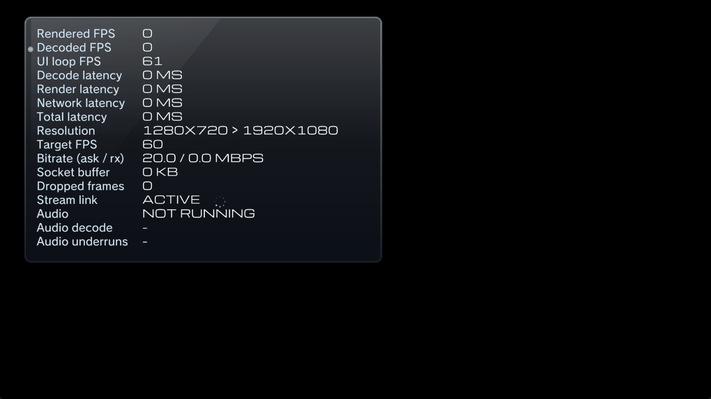

# Moonlight PS3

Stream your PC to a PlayStation 3. Moonlight PS3 is a homebrew client for
**Sunshine**, **Vibepollo / Apollo** and NVIDIA GameStream hosts.

This fork takes the original client from 720p stereo to **1080p at 59.94 fps,
5.1 / 7.1 surround, and CRT-friendly output**, and fixes the things that used to
make high-bitrate streams fall over.

---

## What's new in 2.0

A new look and a calmer set of screens. The streaming engine is unchanged.



| | |
| :--- | :--- |
| **PCs are cards** | Each saved PC is a glass card with a status pill (Ready, Not paired, Playing a game). Add PC, Options and Remove PC replace the IP field. |
| **Aero look, day and night** | Glossy glass over an aqua sky with an XMB-style wave and drifting bubbles. Night is a darker Aero. Settings > Screen > Theme: Auto (day 07:00-19:00 by the console clock), Day or Night. |
| **Fits every output** | Menus are laid out on a 720-high canvas, 1280 wide for 16:9 and 960 wide for 4:3, inside a safe margin. 480, 576, 720 and 1080 outputs in either shape. |
| **Settings you can read** | Six sections in plain words, each row with a one-line explanation. Engineer settings live under Advanced. |
| **Friendlier errors and pairing** | A big PIN, what to do next, and the host's own reason when it says no. |
| **Log on demand** | The permanent log pane is gone. SELECT slides the log up on any menu. |
| **Toasts** | A PC that moved, a game that quit, a permission the host denies, and how to leave a stream all appear as short messages. |

### Screens

| | |
| :--- | :--- |
| <br>Choose a PC | <br>Find a PC |
| <br>Pairing | <br>When something goes wrong |
| <br>Settings | <br>Games |
| <br>4:3 standard-definition output | <br>Stats overlay |

**Changed for 2.0:** START still connects to the focused PC, and Settings is a
card at the end of the row. The games list is still a plain list. Fonts: see
[docs/FONTS.md](docs/FONTS.md). Screenshots are from the RPCS3 emulator, not a
console.

### Roadmap

Ideas left for later 2.x releases: box art and a games shelf, quit-and-switch
when another game is running, quality presets, Wake-on-LAN, per-PC online
status, an in-stream overlay menu, XMB sound effects, localisation, renaming
PCs, and hiding or favouriting games.

---

## What's new in 1.4

| | |
| :--- | :--- |
| **1080p59.94** | Full 1080p60 on real hardware, with correct colours and about 31 ms decode latency. Needs one host setting; see [PC setup](#pc-setup-for-1080p60). |
| **5.1 / 7.1 surround** | High-quality multichannel Opus. Pick Stereo, 5.1 or 7.1 in Settings. |
| **Up to 50 Mbps** | New bitrate steps (12.5 to 60), and the crashes that used to appear at high bitrate are fixed. |
| **CRT and SD output** | Automatic frame rate and resolution for 50 Hz and 4:3 sets, 4:3 stream sizes, a picture-shape option, and overscan controls. |
| **Vibepollo / Apollo support** | Permissions, virtual display at the exact stream mode, launch by app UUID, OTP pairing. |
| **Controller upgrades** | DS3 rumble, analog L2/R2 triggers, and the Square / Triangle swap fixed. |
| **Easier pairing** | Pairing follows the host, not its IP address. The PS3 waits 10 minutes for you to type the PIN. |
| **Clean exit** | Leaving a stream with the PS button now ends the session on the host too. |
| **Scrolling Settings** | Grouped into Video, Network & Host, Controls and Display (reorganised in 2.0). Everything that used to need `config.ini` is a row. |
| **One-click host setup** | `tools\setup-host.cmd` configures the PC for you. |

> **Status.** 1080p59.94, YUV colours, 40-50 Mbps streaming, and the PS-button
> quit have been run on a real PS3 and TV. The surround audio, CRT / SD output,
> rumble, analog triggers and host-identity changes are in the 1.4.0 betas and
> have **not** yet been confirmed on hardware. Reports welcome.

---

## Surround audio

Settings > Sound > **Audio**: Stereo (default), 5.1 or 7.1.

- Surround uses Moonlight's high-quality Opus mode (separate streams, 5 ms
  packets), which switches on automatically at 15 Mbps or more.
- It is lossy by protocol. Moonlight has no lossless or passthrough audio.
- A `[PS3-AUD]` line in the log (and an Audio row in the stats overlay) shows
  decode time, underruns, drops and per-channel levels.
- Multichannel PCM only reaches a receiver if your PS3's HDMI output offers it.
  If a 5.1 stream loses the centre channel, check the console's audio output
  settings first.
- Saved as `audio_channels` (`2`, `6` or `8`) in `config.ini`.

---

## 1080p at 59.94 fps

The PS3 decodes 1080p60 comfortably, **if the stream leaves out CABAC and the
H.264 deblocking filter**. Hardware encoders (NVENC, AMF, QuickSync) always use
both, and a PS3 needs about 147 ms per frame for that, so it cannot keep up. x264
with the right settings does not, and takes about 31 ms per frame.

Client settings that go with it:

- **1080p, 60 FPS** (shown as 59.94, the PS3's real output rate).
- **Settings > Advanced > Decoder output: YUV (faster)**. The colours are correct as of this fork.
- **Bitrate 40-50 Mbps.** The client asks the host for 80% of the setting, and
  x264 delivers well under that. Measured on Cyberpunk 2077: the 12.5 setting
  delivered about 5 Mbps; 50 delivered about 30 Mbps at a steady 60 fps with no
  lost frames.

Other modes: 960x544, 1280x720 and 1792x1008, at 30 / 50 / 60 / 120 fps. 960x544
is the lowest-latency choice.

## PC setup for 1080p60

720p works with any host settings. 1080p60 needs one change on the PC.

### Quick way

On the streaming PC, double-click **`tools\setup-host.cmd`**. It asks for your
web UI login, detects Sunshine, Apollo or Vibepollo, and applies only what that
host supports.

```powershell
.\tools\setup-host.ps1                  # apply
.\tools\setup-host.ps1 -DryRun          # show what it would change
.\tools\setup-host.ps1 -Pacing 60000    # Vibepollo on Wi-Fi: also pace the sender
.\tools\setup-host.ps1 -Revert          # undo
```

### Manual settings

| setting | value | Vibepollo | Apollo | Sunshine |
| :--- | :--- | :--- | :--- | :--- |
| `encoder` | `software` | per client (Client Management > overrides) | global | global |
| `sw_preset` | `veryfast` | per client | global | global |
| `sw_tune` | `zerolatency,fastdecode` | per client | global | global |
| permissions | Launch, View, List, Controller, Mouse, Keyboard | **required** | **required** | n/a |
| `pacing_max_bitrate_kbps` | `60000` (Wi-Fi hosts) | global, optional | n/a | n/a |

"Global" means every client uses software x264, not only the PS3. `veryfast` at
1080p60 is real CPU load; if the PS3 log shows fewer than 60 frames arriving, try
`superfast` or `ultrafast`.

**Use a wired PC if you can.** Every multi-second hitch in testing was the host's
Wi-Fi stalling. Nothing on the PS3 can hide a link that stops.

---

## CRT and SD output

- **Auto frame rate:** 50 fps on a 50 Hz output.
- **Auto resolution:** 4:3 SD gets 640x480 or 768x576, 16:9 SD gets 960x544, HD
  gets 720p.
- **4:3 stream sizes:** 640x480, 768x576, 1024x768.
- **Settings > Picture > Aspect:** Fit (black bars) or Stretch (`aspect_mode`).
- **Overscan** (`overscan_x`, `overscan_y` in %, `overscan_xoff`,
  `overscan_yoff`): shrinks and shifts menus and stream together so the edges
  survive a CRT. Defaults are 100% / 0, and 90% x 92% on an SD output.

Settings saved by older versions keep their explicit frame rate and resolution;
choose **Auto** in Settings to switch. Menus follow the output shape (16:9 or
4:3) and stay inside a safe margin, so they are not squashed on a 4:3 set.

---

## Controller and host handling

- **Rumble** (`rumble=1`): host rumble goes to the DS3 motors, sent only when the
  value changes, and silenced when the stream ends or the XMB opens.
- **Analog triggers** (`trigger_mode=1`): L2/R2 pressure from the DS3. Pads with
  no pressure sensors still give a full-strength trigger. `trigger_mode=0` forces
  digital.
- **Face buttons:** Square and Triangle now map to X and Y correctly.
- **Host identity:** pairing is keyed on the host's `<uniqueid>`. A DHCP change or
  rename does not need a re-pair, and a host that moves is found again on the LAN.
- **Quit app on host:** the PC card shows *Playing <app>* and its Options (triangle)
  offer *Quit <app> on PC* whenever the host reports something running, even after
  a dropped connection or a client restart.
- **Clean exit:** the PS button or the exit combo ends the host session. A dropped
  connection leaves it running so you can resume.
- **Host discovery:** hosts on the LAN are found automatically over mDNS.

### Vibepollo / Apollo extras

When the host advertises them, the client also uses: a virtual display created at
the exact stream mode (`1920x1080x59.94`), launch by app UUID, the host's own
permission messages on the error screen, and OTP pairing through
`/dev_hdd0/tmp/moonlight_otp.txt` (`<PIN> <passphrase>`). Plain Sunshine gets the
standard requests.

---

## High-bitrate stability

Steps are 2.5, 5, 10, 12.5, 15, 20, 25, 30, 40, 50 and 60 Mbps (default 20).
What changed to make them usable:

- **No more crash after ~25 minutes.** The console's network pool could run dry
  for a moment and every socket failed at once. That is now treated as a pause
  rather than a disconnect, everywhere it can occur.
- **Receive buffer sized to one keyframe**, not a time window.
- **Periodic intra refresh** requested from the host, so keyframe bursts become
  evenly sized frames (`intra_refresh=0` turns it off).
- **Latency:** a pacing option (smooth / balanced / newest-only), a short decode
  queue, and 8 decoder buffers.
- **Telemetry:** a once-per-second `[PS3-NET]` line in
  `/dev_hdd0/tmp/moonlight_log.txt`, also broadcast as UDP to port 18194. The
  fields and the measurements behind all of this are in
  [docs/performance-notes.md](docs/performance-notes.md).

---

## Controls

| Action | Controller | Keyboard / Mouse |
| :--- | :--- | :--- |
| Navigate menus | D-Pad | Arrow keys |
| Select / Launch | Cross (✕) | Enter / Left click |
| Back / Exit to XMB (confirms) | Circle (◯) | Escape / Right click |
| Edit Host IP | Cross (✕) on the Host IP row | Type directly |
| Change a setting | Left / Right / Cross | Left / Right / Enter |
| Settings page up / down | L1 / R1 | n/a |
| Emergency stream abort | `Select + Start + L3 + R3` | `Ctrl + Shift + Alt + Q` |

USB and Bluetooth keyboards and mice work, with a Game mode (relative motion) and
a Desktop mode (absolute 1:1), selectable in Settings.

---

## Install and pair

1. Download the `.pkg` from [Releases](../../releases) (or build it, below) and copy
   it to a FAT32 USB drive.
2. On a jailbroken PS3 (CFW or HEN): **Game > Package Manager > Install Package
   Files > Standard**.
3. Launch **Moonlight PS3** and choose **Add PC**. Your PC should appear; if not,
   choose **Enter IP address...**.
4. Select the PC. Type the on-screen PIN into the Sunshine web UI under **PIN**.
   The PS3 waits up to 10 minutes.
5. **Vibepollo / Apollo:** a new device may only list and watch. Grant Launch,
   Controller, Mouse and Keyboard under **Client Management**, or run
   `tools\setup-host.cmd`.
6. Pick a game or the desktop from the app list.

## Build from source

Needs the PSL1GHT / ps3dev toolchain.

```bash
git clone https://github.com/vortigauntlet/PS3-Moonlight
cd PS3-Moonlight
make prepare   # downloads the ps3dev SDK into ./ps3dev
make           # builds build/moonlight-ps3.pkg and moonlight-ps3.gnpdrm.pkg
```

---

## Original features

Hardware H.264 decoding through `cellVdec` into RSX memory, an app list parsed from
the host, native PS3 system dialogs, a persistent `config.ini` in
`/dev_hdd0/game/MNLT00001/USRDIR/`, FreeType rendering with the console's own
fonts, selectable VSync / HSync flip mode, a stats overlay, and Opus audio.

---

## Credits

- **[Moonlight-QT](https://github.com/moonlight-stream/moonlight-qt)**, **[Moonlight Common C](https://github.com/moonlight-stream/moonlight-common-c)** and **[Opus](https://opus-codec.org/)**: the protocol, streaming core and audio codec.
- **[Cruslan](https://github.com/Cruslan/PS3-Moonlight)**: the original PS3 client this fork builds on.
- **[Tiny3D](https://github.com/ps3dev/ps3libraries)** by Hermes: a patched copy of `tiny3d.c` ships in `third_party/tiny3d_yuvfix/` to fix the green terms of its planar YUV shader (see that folder's README).
- **[TEE PS3 Remoteplay](https://github.com/TheErsysEnding/TEE-PS3-Remoteplay-PC-games-on-PS3-Streaming)** and mohasi's cell-stream: the measurements showing 1080p60 decodes on a PS3 when deblocking and CABAC are off, and that 59.94 Hz is the rate to stream at.
- **[Okeanos86](https://github.com/Okeanos86/PS3-Moonlight)**: mDNS host discovery, and the ideas behind rumble, pressure triggers, the Name (IP) host row, host-keyed pairing, the quit-app item and SD / 960x544 overscan, re-implemented here.
- **GarryJerry**: the Square / Triangle fix.
- **[Vibepollo](https://github.com/Nonary/Vibepollo)** / **[Apollo](https://github.com/ClassicOldSong/Apollo)**: per-client overrides, permissions, virtual display and send pacing.
- **[PS3DEV / PSL1GHT](https://github.com/ps3dev/ps3dev)**: the toolchain and SDK that make PS3 homebrew possible.
- **[Mohammed Asif (mohasi)](https://codeberg.org/mohasi)**: technical guidance and inspiration.
- **AcidNT3.1**, **SyrianClippy**, **Okeanos**: testing and feedback.

## License

GNU General Public License v3.0 (GPLv3).
